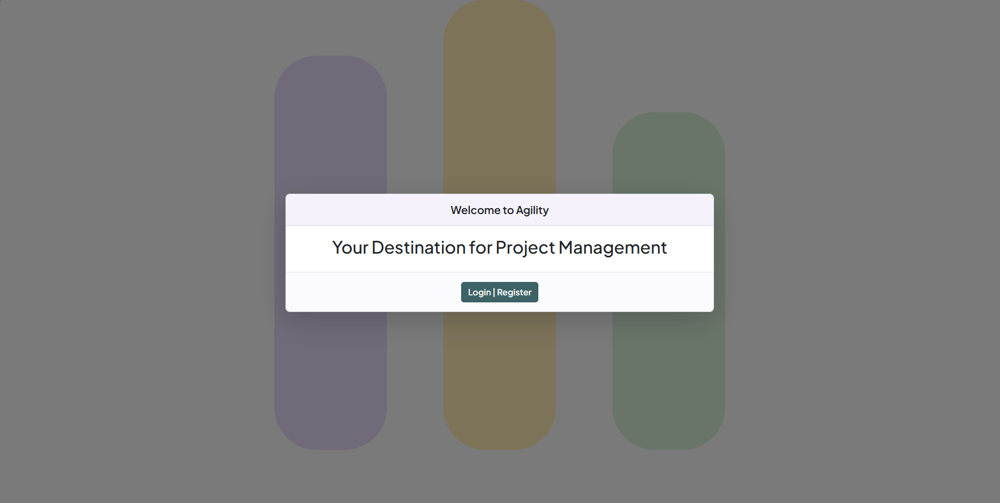
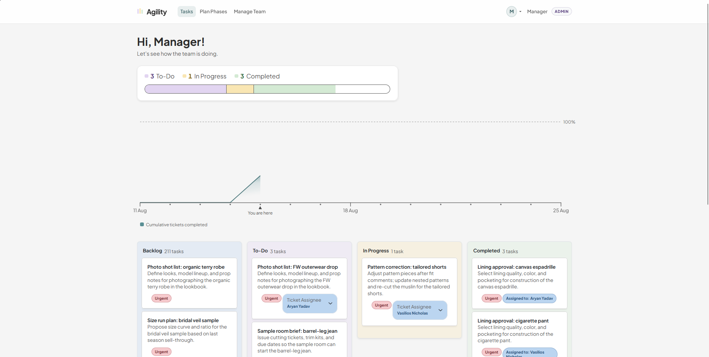
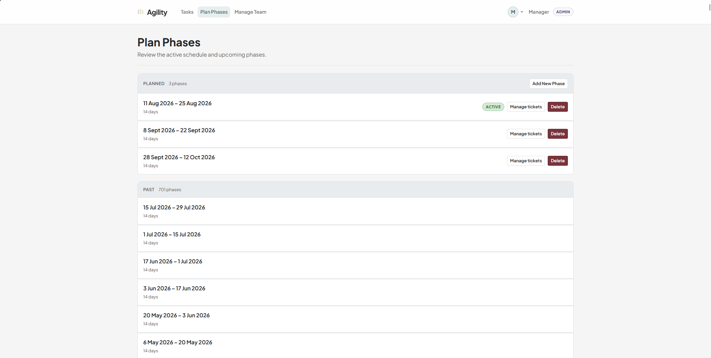
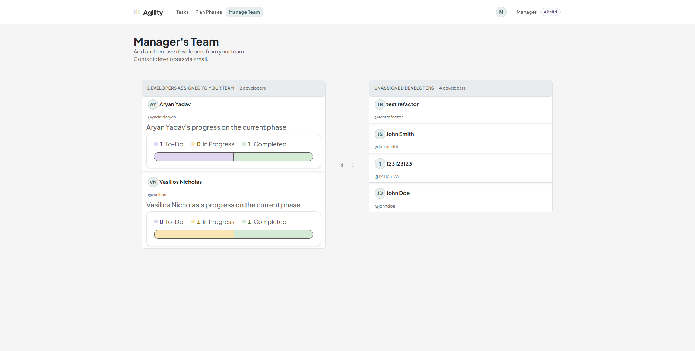
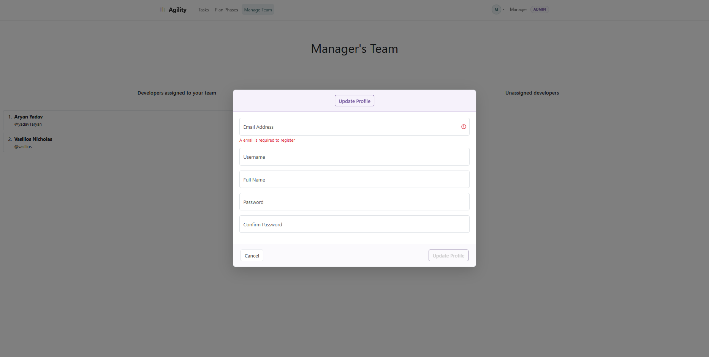

# Agility

**Agility** is a full-stack application that implements an agile framework for managing projects in an easy-to-use interface. Agility’s goal is to simplify the process of assigning, coordinating, and managing tasks across a project team, thereby reducing overhead for managers and project leaders. Its simplified, non-esoteric workflow helps newcomers to agile management benefit from a structured approach to product development without the complexity of traditional project-management tools. Agility was built with TypeScript, React, Vite, Node.js, Express, Bootstrap 5 / React-Bootstrap, Passport, and MongoDB.

Use these credentials with our deployment to get an idea of what the project looks and functions like: user: manager pass: bb361234

For our live demo, the database hosts sample project phases and tickets with mock data for certain fields. The seed tickets collection is composed of mock apparel/product-development style tasks.

> _Login page of Agility._
> 
> _Tasks (Kanban) page of Agility._
> 
> _Plan Phases page of Agility._
> 
> _Manage Team page of Agility._
> 
> _Update Profile modal of Agility._
> 

## Live Demo and Documentation

- **[Deployed Site Link](https://agility-1qtf.onrender.com/)**
- **[Live Demo Video Walkthrough](https://youtu.be/SImYEdfxcVA)**
- **[Project slides](https://docs.google.com/presentation/d/1lX3IiBtWi5AElx8y_LpXDi7BWCgt_Duwegf3cOfrIPI/edit?usp=sharing)**
- **[Design Document](https://docs.google.com/document/d/159umoDcDq4ZdloeNzaaqiC0UZGvfEbOEEepKRk__HHQ/edit?usp=sharing)**

## Authors

* Aryan Yadav: Kanban / tasks full-stack.
* Vasilios Nicholas: Authentication, phases, and team management full-stack.

## Project Objective

The goal of Agility is to make agile project management simpler and more approachable than typical tools. Managers can plan phases, assign developers to a team, create and assign tickets, and track progress on a Kanban board. Developers can create tickets for themselves and act on tickets assigned by their manager — all in one place.

This project was created as the third project for [CS5610 Web Development](https://johnguerra.co/classes/webDevelopment_online_summer_2026/) at Northeastern University, during the Summer 2026 semester.

From a technical standpoint, the project was built to practice full-stack web development using Node.js, Express, MongoDB, TypeScript, and a React single-page application. Specific objectives include:

* Building a React SPA with client-side routing, where the Express server serves the built frontend and protects routes by authentication and account type.
* Implementing a REST API with Express that supports CRUD operations across three MongoDB collections: `users`, `tickets`, and `phases`.
* Using session-based authentication with Passport Local and bcrypt-hashed passwords.
* Enforcing role-based access so managers can plan phases and manage teams, while developers work tickets on the active-phase Kanban board.
* Deploying the application to a public server so it is accessible to real users.

## App Instructions

Navigating to Agility presents a login/register gate. After creating an account as a **Developer** or **Manager** (or signing in), you are taken to the **Tasks** page.

On **Tasks**, you see a summary of ticket statuses, a cumulative completion chart for the active phase, and a Kanban board. Developers can create tickets for themselves in the active phase and move tickets assigned to them across **To-Do**, **In Progress**, and **Completed**. Managers can additionally use a **Backlog** column, create and assign tickets for their team, and delete tickets.

Managers can open **Plan Phases** to review planned and past phases, add new phases with start and end dates, delete phases, and manage which backlog tickets belong to a phase. Managers can also open **Manage Team** to see developers assigned to their team versus unassigned developers, assign or unassign developers, and email team members.

From the profile menu in the navbar, any signed-in user can **Update Profile** (email, username, full name, password) or delete their account.

## Project Structure

```
Agility
├── eslint.config.js                            # ESLint config file.
├── .env.example                                # Example environment variables for local/hosted runs.
├── LICENSE                                     # MIT license.
├── package.json                                # Backend / root dependencies and scripts.
├── package-lock.json
├── tsconfig.json                               # TypeScript project config.
├── README.md                                   # Project README.
├── data
│   └── seed-tickets.json                       # Optional mock ticket documents for MongoDB.
├── res                                         # README screenshots.
│   ├── login.png
│   ├── tasks.png
│   ├── phases.png
│   ├── manageteam.png
│   └── updateprofile.png
├── frontend                                    # React + Vite SPA.
│   ├── package.json
│   ├── vite.config.ts
│   ├── index.html
│   └── src
│       ├── main.tsx                            # SPA entry point and router.
│       ├── pages
│       │   ├── IndexPage.tsx
│       │   ├── LoginPage.tsx
│       │   ├── Kanban.tsx                      # Tasks / Kanban board page.
│       │   ├── PlanPhases.tsx
│       │   ├── ManageTeam.tsx
│       │   ├── Unauthorized.tsx
│       │   └── NotFound.tsx
│       ├── components
│       │   ├── AppNavbar.tsx
│       │   ├── FormWindow.tsx
│       │   ├── authentication                  # Login / register UI.
│       │   ├── kanban                          # Board, cards, drag-and-drop, new ticket modal.
│       │   ├── phases                          # Phase list and ticket assignment modals.
│       │   ├── management                      # Team assignment UI.
│       │   └── profile                         # Update / delete profile.
│       ├── hooks
│       ├── styles
│       └── utils
└── src
    ├── shared
    │   └── models                              # Shared TypeScript models for users, tickets, phases, Kanban.
    └── backend
        ├── index.ts                            # Creates Express app, mounts routes, serves SPA, starts server.
        ├── managerTeam.ts                      # Manager ↔ developer team helpers.
        ├── authentication
        │   ├── Authenticator.ts                # Passport Local strategy setup.
        │   └── CredentialsManager.ts           # Password hashing / verification with bcrypt.
        ├── middleware
        │   └── AuthenticationMiddleware.ts     # Auth and account-type guards.
        ├── database
        │   ├── Database.ts                     # MongoDB connection singleton.
        │   ├── UserOperations.ts
        │   ├── TicketOperations.ts
        │   └── PhaseOperations.ts
        └── routes
            ├── Auth.ts                         # Register, login, logout, current user.
            ├── Users.ts                        # Profile update / delete.
            ├── Kanban.ts                       # Ticket CRUD and status moves.
            ├── Phases.ts                       # Phase CRUD and phase ticket management.
            └── Developers.ts                   # Assign / unassign developers to a manager.
```

## Installation and Local Development

1. **Clone the repository using git**

   ```bash
   git clone https://github.com/vasiliosnicholas/Agility.git
   cd Agility
   ```

2. **Ensure Node.js v24 is installed on your system**

   ```bash
   node --version
   ```

3. **Install project dependencies for the backend/root and frontend**

   ```bash
   npm install
   cd frontend
   npm install
   cd ..
   ```

4. **Install MongoDB on your system using a container or natively and start the MongoDB instance.**

5. **(Optional) Import mock tickets from `./data/seed-tickets.json` into your tickets collection.**

6. **Using `.env.example` for the required environment variables, fill out a `.env` file:**

   ```
   HOST=localhost
   PORT=3000
   SESSION_SECRET=<a strong secret used to sign session cookies>
   MONGODB_URI=<mongodb://localhost:27017 or your MongoDB Atlas URI>
   DB_NAME=agility
   DB_USERS_COLLECTION_NAME=users
   DB_TICKETS_COLLECTION_NAME=tickets
   DB_PHASES_COLLECTION_NAME=phases
   NODE_ENV=development
   ```

7. **Build the frontend (required before `npm start`, and useful so Express can serve the SPA):**

   ```bash
   cd frontend
   npm run build
   cd ..
   ```

8. **Choose how to run the app:**

   * For **local development**, run the backend and frontend in separate terminals:

     ```bash
     npm run dev
     ```

     ```bash
     cd frontend
     npm run dev
     ```

     The Vite dev server proxies API requests to the Express backend on port 3000.

   * For a **production-style local run**, build both projects, then start Express:

     ```bash
     cd frontend && npm run build && cd ..
     npm run build
     npm start
     ```

## Third-Party APIs & Libraries & Deployment Environments

* **Express** — Web framework for Node.js used to build the REST API and serve the built React SPA.
* **MongoDB Node.js Driver** — Official driver used to connect to and query MongoDB collections.
* **Passport / passport-local** — Session-based authentication with a local username/password strategy.
* **bcrypt** — Password hashing for stored user credentials.
* **express-session** — Server-side sessions and signed cookies.
* **React + Vite** — SPA frontend toolchain and UI runtime.
* **React Router** — Client-side routing for Tasks, Plan Phases, Manage Team, and auth pages.
* **Bootstrap 5 / React-Bootstrap** — Responsive layout and UI components.
* **react-hook-form + Yup** — Form state and validation for auth and profile flows.
* **Render** — Deployment environment for the Express backend (and served frontend).
* **MongoDB Atlas** — Deployment environment for the MongoDB database.

## Gen AI Usage Disclosure

* Gemini used for searching through documentation and finding helpful resources.
* Cursor AI used for generating this README and mock data.

## License

This project is licensed under the MIT License.
